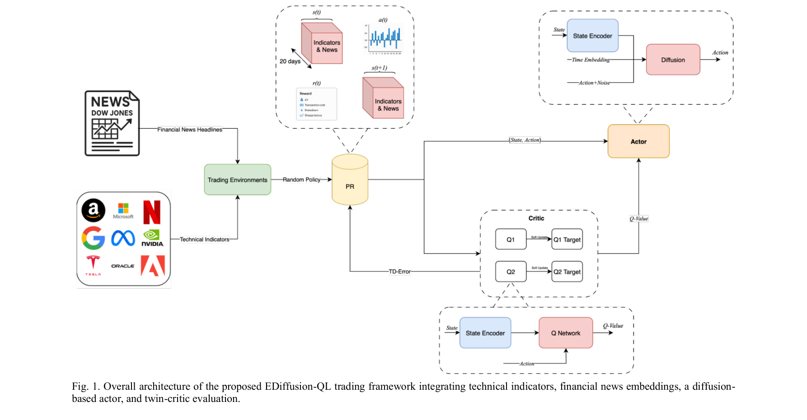
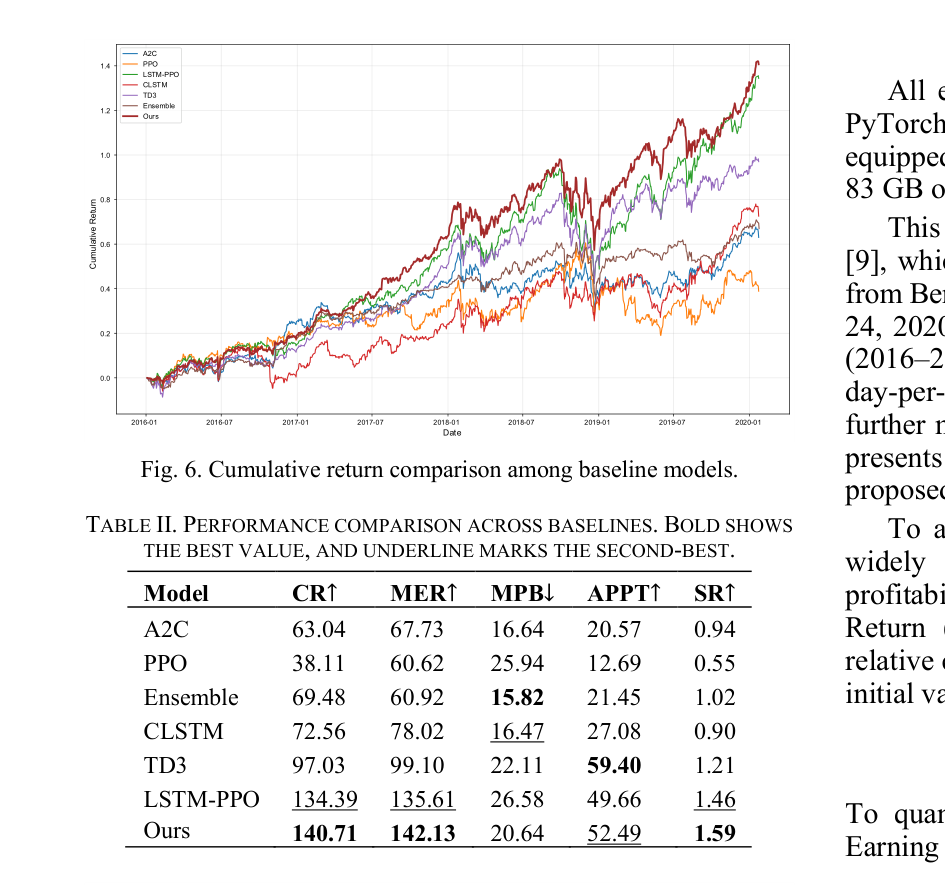
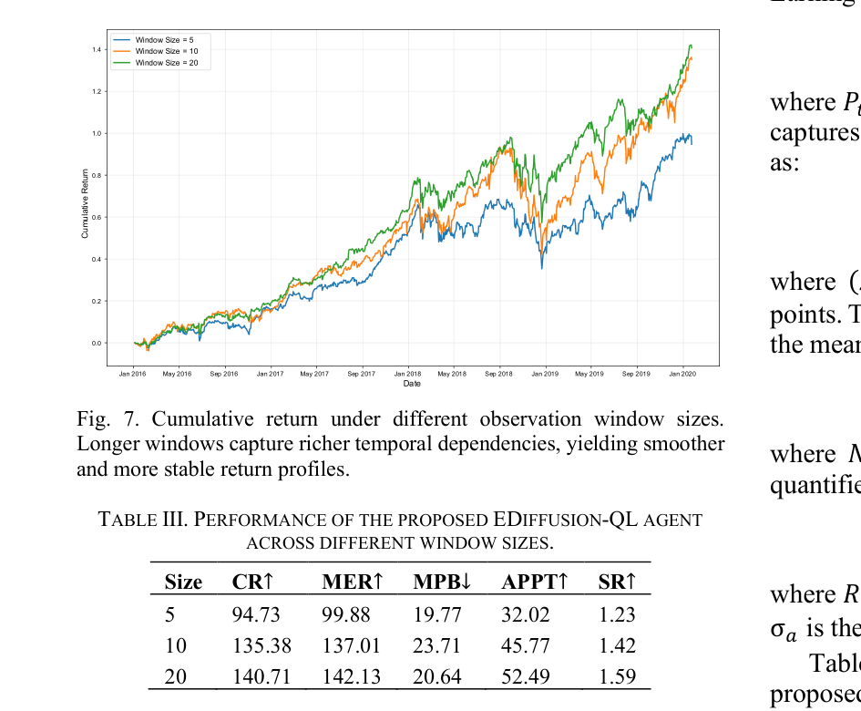

# Enhanced Diffusion Policy for Robust Multimodal Stock Trading

[]()
[]()
[]()
[]()

This repository contains the implementation of my B.Sc. thesis project, presented as:

> **Enhanced Diffusion Policy for Robust Multimodal Stock Trading through the Integration of Technical Indicators and Fundamental News**  
> Amirali Vakili, Mahan Veisi, Mahdi Shahbazi Khojasteh, Armin Salimi-Badr  
> IEEE conference paper, IICAI 2026

The project applies an **Enhanced Diffusion-QL (EDiffusion-QL)** framework to automated stock trading. The model combines **technical indicators**, **financial news embeddings**, a **Bi-LSTM temporal state encoder**, a **diffusion-based actor**, and **twin Q-learning critics** to generate robust continuous trading actions under volatile market conditions.

---

## Overview

Financial markets are noisy, non-stationary, and influenced by both historical price behavior and external information. Standard deep reinforcement learning methods often rely on restrictive policy distributions, which may not capture the multi-modal nature of trading decisions.

This project addresses that limitation by using a **diffusion-based policy** for action generation. Instead of producing a single deterministic or unimodal action, the policy learns to generate diverse buy/sell allocations through an iterative denoising process.

<p align="center">
  
</p>

---

## Key Contributions

- **Multimodal trading state** combining technical indicators and FinBERT-based financial news embeddings.
- **Bi-LSTM state encoder** for capturing temporal dependencies over a 20-day observation window.
- **Diffusion-based actor** for expressive and multi-modal continuous action generation.
- **Twin Q-learning critics** to reduce overestimation bias and improve value estimation.
- **Prioritized Experience Replay (PER)** for more sample-efficient off-policy learning.
- **Risk-aware reward design** including portfolio return, transaction costs, and drawdown penalty.

---

## Method

The trading problem is formulated as a Markov Decision Process (MDP):

- **State:** technical indicators + daily financial news embeddings.
- **Action:** continuous trading intensity for each stock in the range `[-1, 1]`, later converted to discrete share orders.
- **Reward:** change in portfolio value minus transaction cost and drawdown penalty.

The full model consists of:

1. **Trading environment** using historical market data and news signals.
2. **Bi-LSTM state encoder** for temporal representation learning.
3. **Diffusion actor** for denoising-based action generation.
4. **Twin critic networks** for robust Q-value estimation.
5. **PER buffer** for stable and efficient off-policy updates.

---

## Dataset and Experimental Setup

The experiments follow a U.S. equity trading setup with:

- **30 U.S. stocks**
- **Daily financial news from Benzinga**
- **Technical indicators:** adjusted close price, MACD, MACD signal, MACD histogram, CCI, RSI, ADX
- **News embeddings:** FinBERT representations averaged per trading day
- **Training period:** 2009-2015
- **Testing period:** 2016-2020

The model was implemented in **Python** using **PyTorch** and trained on **Google Colab Pro with an NVIDIA A100 GPU**.

---

## Results

The proposed EDiffusion-QL model outperformed several deep reinforcement learning baselines, including A2C, PPO, Ensemble DRL, CLSTM, TD3, and LSTM-PPO.

| Model | CR | MER | MPB | APPT| SR |
|---|---:|---:|---:|---:|---:|
| A2C | 63.04 | 67.73 | 16.64 | 20.57 | 0.94 |
| PPO | 38.11 | 60.62 | 25.94 | 12.69 | 0.55 |
| Ensemble | 69.48 | 60.92 | **15.82** | 21.45 | 1.02 |
| CLSTM | 72.56 | 78.02 | 16.47 | 27.08 | 0.90 |
| TD3 | 97.03 | 99.10 | 22.11 | **59.40** | 1.21 |
| LSTM-PPO | 134.39 | 135.61 | 26.58 | 49.66 | 1.46 |
| **EDiffusion-QL (Ours)** | **140.71** | **142.13** | 20.64 | 52.49 | **1.59** |

<p align="center">
  
</p>

The 20-day observation window achieved the best overall performance, showing that longer temporal context helps the Bi-LSTM encoder capture richer dependencies between market behavior and sentiment signals.

<p align="center">
  
</p>

---

## How to Run

1. Clone the repository:

```bash
git clone https://github.com/simbovk/Diff-Stock-BSc-Thesis-Project.git
cd Diff-Stock-BSc-Thesis-Project
```

2. Open the notebook:

```bash
jupyter notebook Diff_Stock_implementation.ipynb
```

3. Run the cells in order after preparing the required market and news data.

> Note: The full dataset may not be included in this repository because of licensing, size, or third-party data-access limitations.

---

## Citation

If you use this repository or build on this work, please cite:

```bibtex
@inproceedings{vakili2026ediffusionql,
  title={Enhanced Diffusion Policy for Robust Multimodal Stock Trading through the Integration of Technical Indicators and Fundamental News},
  author={Vakili, Amirali and Veisi, Mahan and Shahbazi Khojasteh, Mahdi and Salimi-Badr, Armin},
  booktitle={IEEE Conference Proceedings},
  year={2026}
}
```

---

## Disclaimer

This repository is intended for academic research only. It does not provide financial advice, investment recommendations, or a production-ready trading system. Backtested performance does not guarantee future results.

