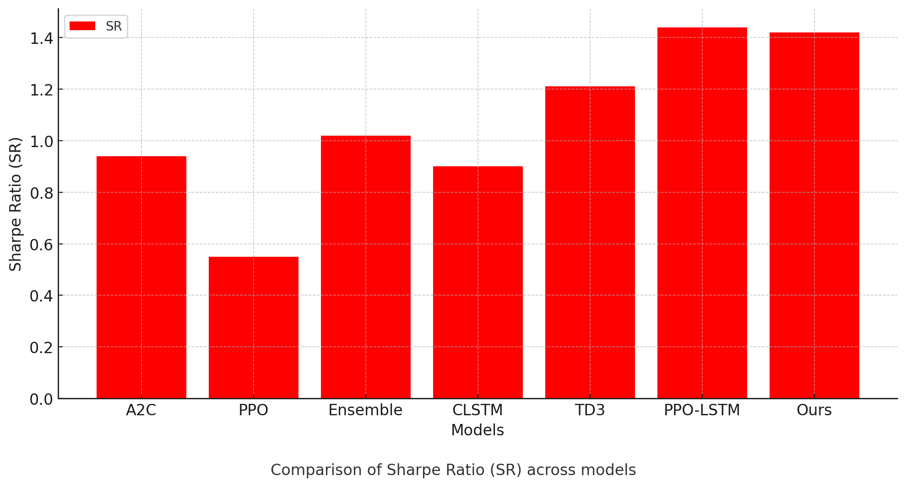

# Deep Reinforcement Learning-based Stock Trading with Diffusion Policy

## Overview
This project implements a deep reinforcement learning (DRL) model for stock trading, utilizing an advanced **Diffusion Policy**. The model integrates both **technical indicators** and **financial news** sentiment, allowing the agent to decide on **buy**, **sell**, or **hold** actions. The main contribution of this work is the enhancement of the diffusion policy from [Diffusion Policy GitHub](https://github.com/real-stanford/diffusion_policy?tab=readme-ov-file) and the paper "[Diffusion Policy for Efficient Reinforcement Learning](https://arxiv.org/abs/2303.04137v5)" to make it more suitable for the **stock trading domain**. 

### Enhancements in Our Project:
- **Diffusion Policy**: We build on the diffusion policy framework by adding the **Proximal Policy Optimization (PPO)** algorithm and a custom **state encoder** using **Bidirectional LSTM (Bi-LSTM)** for better market prediction.
- **Actor-Critic Architecture**: The agent uses the **Actor-Critic** framework, where the Actor proposes actions, and the Critic evaluates those actions. We apply **PPO** for better policy optimization.
- **State Encoder (Bi-LSTM)**: We use a **Bi-LSTM** encoder to capture time-series dependencies in stock market data, enabling better understanding of market trends.

## Key Features:
- **Diffusion Policy Integration**: The core of the model uses a **Diffusion Policy** to handle noisy financial data and volatile market conditions. The diffusion process helps learn robust trading strategies.
- **Technical & Fundamental Data**: The model integrates both **technical indicators** (such as RSI, MACD, CCI) and **fundamental analysis** (via sentiment analysis using FinBERT for financial news).
- **PPO and Actor-Critic**: We enhance the standard **Diffusion Policy** using the **Proximal Policy Optimization (PPO)** algorithm to ensure stable and efficient training.
- **State Encoder with Bi-LSTM**: The model uses **Bidirectional LSTM** (Bi-LSTM) to better understand the historical sequence of stock prices and news sentiment for more accurate decision-making.
- **Performance Metrics**: The model is evaluated using important financial metrics such as **cumulative return**, **Sharpe ratio**, **maximum pullback (MPB)**, and **average profit per trade (APPT)**.

## Figures

### 1. Performance Comparison:
The following figure compares the performance of the model (labeled as "Ours") with traditional approaches (A2C, PPO, Ensemble, CLSTM, TD3, PPO-LSTM) using various metrics: CR%, MER%, MPB%, and APPT.

### 2. Sharpe Ratio Comparison:
This figure illustrates the Sharpe Ratio (SR) across various models, showcasing the effectiveness of the proposed model in achieving risk-adjusted returns.

### 3. Cumulative Return:
This figure demonstrates the **Cumulative Return** over time, showing the agent's performance as it interacts with the stock market environment. The cumulative return is a key metric for evaluating how well the agent's policy maximizes long-term returns.

### 4. Methodology Overview:
The architecture diagram below shows the model's components, including data inputs (financial news, indicators), the state encoder, diffusion process, Actor-Critic components, and the Q-value evaluation network.

## Methodology

### 1. Data Collection:
- **Technical Indicators**: The model uses various technical indicators like **RSI**, **MACD**, **CCI**, and **ADX** to assess market conditions.
- **Financial News**: News articles are processed using **FinBERT** for sentiment analysis to extract meaningful insights about stock performance.

### 2. Diffusion Policy:
The diffusion process introduces noise at each time step, gradually transforming the data. The goal is for the model to learn how to reverse this noise to predict future stock prices. The process involves:
- **Forward Diffusion**: Adding noise progressively to stock data.
- **Reverse Diffusion**: Reversing the noise at each step to forecast future market conditions.

### 3. PPO & Actor-Critic Architecture:
The agent uses **PPO** within the **Actor-Critic framework**, where the **Actor** proposes actions (buy, sell, hold) based on the state, and the **Critic** evaluates the quality of these actions using Q-values. The **PPO** algorithm ensures efficient policy updates and stable training.

### 4. State Encoder (Bi-LSTM):
We use **Bidirectional LSTM (Bi-LSTM)** as the state encoder to process historical stock data. The Bi-LSTM helps capture the dependencies in both directions of the time-series data, improving the model’s ability to understand market trends and make better predictions.

### 5. Training and Evaluation:
- **Training**: The agent is trained on historical data from **2008–2016** and evaluated on out-of-sample data from **2016 untill 2020**.
- **Metrics**: The agent's performance is evaluated using **cumulative return**, **Sharpe ratio**, **maximum drawdown**, and other relevant financial metrics.
